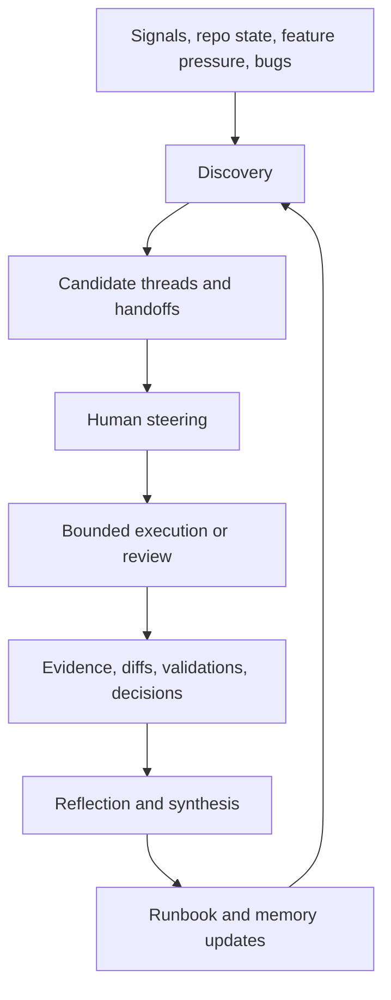
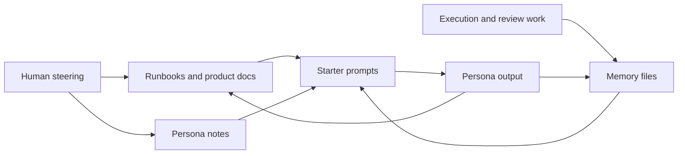

# Emergent Agent Architecture for Spindle

This document describes the current agent-support infrastructure for `Spindle`.

It adapts the lightweight `udftools` fork model to a seven-persona, full-stack Rust, Tauri, React desktop application without turning the workflow into a heavy framework.

The goal is practical continuity:

- lightweight markdown instead of rigid orchestration software
- shared runbooks instead of hidden context
- structural memory instead of narrative journals
- bounded persona roles instead of vague "generalist" agents

Update this document when the handoff model, role boundaries, or shared artifact set changes in a meaningful way.

## Purpose

Spindle has more moving parts than the earlier extraction project:

- React and TypeScript user interface work in `apps/spindle/src/`
- Tauri shell and native integration in `apps/spindle/src-tauri/`
- reusable Rust project and build logic in `plugins/tauri-plugin-spindle-project/`
- specification and planning material in `SPEC.md` and `docs/`
- release and packaging flows in `.github/workflows/`, `package.json`, and Tauri config files

That wider surface area makes repeated re-orientation more expensive.

This system exists to reduce that repeated cost while keeping Scott's judgement, taste, and prioritisation at the centre.

## Core Model

The system still works as an emergent loop:

1. discovery
2. human steering
3. bounded execution or review
4. evidence capture
5. memory and runbook updates
6. renewed discovery

## Human Role

Scott remains the orchestrator.

The personas reduce re-explanation, but they do not replace human direction.

The human role is strongest at:

- choosing the next thread worth pursuing
- deciding when a tradeoff is acceptable
- spotting when "interesting" work is drifting away from the product
- setting release priorities
- deciding when the current state is trustworthy enough to ship

## Persona Set

Spindle uses seven named personas with bounded territories.

### Franklin

Franklin is the Studio Director.

He is strongest at:

- release momentum
- runbook upkeep
- repository hygiene
- cross-thread synthesis
- converting scattered findings into the next sensible move

### Edward

Edward is the Product Architect and QA reviewer.

He is strongest at:

- product constraint checking
- optical-disc compatibility review
- identifying strategic traps
- validating whether the plan still matches the real destination
- sharpening acceptance criteria

### Jullian

Jullian is the Master Plumber.

He is strongest at:

- Rust internals
- plugin contracts
- Tauri IPC edges
- FFmpeg and `dvdauthor` orchestration
- deterministic authoring behaviour

### Kyle

Kyle is the Systems Critic.

He is strongest at:

- cross-stack review
- type and payload correctness
- memory safety and error propagation
- concurrency scrutiny
- performance and reliability audits

### Tristan

Tristan is the UX Pragmatist.

He is strongest at:

- React state architecture
- accessibility and keyboard flows
- form and validation logic
- component lifecycle discipline
- translating backend state into trustworthy UI behaviour

### Yuli

Yuli is the UX Specialist.

She is strongest at:

- progressive disclosure
- information architecture
- calm and effortless workflows
- human-factors and user-journey mapping
- usability and design-pattern deconstruction

### Nicholas

Nicholas is the Visual Alchemist.

He is strongest at:

- visual systems
- layout and spacing
- motion and interaction feel
- CSS and Tailwind implementation
- making the authoring studio feel intentional instead of merely functional

## Shared Artifacts

The system depends on a small set of reusable markdown artifacts.

### Persona Notes

Persona notes define:

- identity
- working style
- technical bias
- project fit
- inter-team dynamics

They guide how a persona approaches work.

They are not memory stores.

### Memory Files

Memory files capture durable context such as:

- stable repository facts
- contract boundaries
- recurring traps
- unresolved but durable questions
- reliable handoff patterns

Memory files should stay structural.

They should not become diaries or long narrative logs.

### Runbooks and Product References

Spindle already has shared product and planning material:

- `SPEC.md`
- `README.md`
- `docs/spindle-persona-map.md`
- `docs/initial-planning/`

As the workflow matures, additional runbooks can live under `docs/agents/` or adjacent product-doc locations when a thread needs durable operating instructions.

### Starter Prompts

Starter prompts are the safe re-entry point.

They tell each persona:

- what to read first
- which repository zones to treat as home territory
- what evidence to gather before proposing work
- how to preserve studio culture while staying grounded in the real tree

## The Minimum Viable Handoff

The Minimum Viable Handoff, or MVH, is the smallest shared context package needed for one persona to hand work to another without forcing Scott to restate the entire problem.

For Spindle, a good MVH usually includes:

- the active product or user-facing goal
- the repository area being changed
- the current known constraints
- the exact validation expectation
- the next persona that should touch the thread

### MVH by Layer

#### Frontend MVH

Use this when work moves between Nicholas, Tristan, and Kyle.

Include:

- the user-facing behaviour being changed
- the relevant React or styling files
- state shape or prop contract changes
- accessibility and keyboard expectations
- screenshots, mockup references, or visual constraints when they matter

#### Backend MVH

Use this when work moves between Jullian, Tristan, and Kyle.

Include:

- the Rust or IPC seam being changed
- the TypeScript-facing payload contract
- error and progress reporting expectations
- determinism or filesystem assumptions
- the exact command or fixture used for verification

#### Product and QA MVH

Use this when work moves through Edward or back to Franklin.

Include:

- the relevant product rule from `SPEC.md` or planning docs
- any optical or compatibility limit being enforced
- what was verified versus what is still inferred
- the release, runbook, or documentation impact

## Practical Flow

The usual flow is intentionally simple:

1. Scott selects or reframes a thread.
2. The relevant persona re-orients with its persona note, memory file, and the current product docs.
3. The persona performs bounded execution or review.
4. The outcome is expressed as evidence, not just opinion.
5. Durable facts are written back into runbooks or memory.
6. The next persona receives an MVH rather than a blank slate.

## Example MVH: Subtitle Rendering Thread

If Spindle adds subtitle rendering support, the handoff could look like this:

1. Edward reviews the product shape against `SPEC.md` and flags palette, legibility, and DVD subtitle limitations.
2. Jullian defines the Rust-side job shape, FFmpeg command orchestration, and deterministic output expectations.
3. Kyle reviews the Rust implementation for shell safety, error propagation, and non-blocking execution.
4. Tristan wires the IPC contract into React state, progress reporting, and accessible error messaging.
5. Nicholas builds the visual controls and progress presentation within the known palette and layout constraints.
6. Kyle performs final cross-stack review for type synchronisation, render behaviour, and contract drift.
7. Franklin updates the runbooks, release notes, and packaging or workflow implications.

That flow is heavier than the old three-persona extraction loop, but the core principle remains the same:

the handoff should be just detailed enough to preserve momentum and just light enough to stay maintainable.

## Why This Model Fits Spindle

Spindle is not just a codebase. It is a product studio with:

- hard legacy format constraints
- a modern desktop UI
- a native command-orchestration layer
- release packaging and cross-platform delivery concerns

A single generic agent stance loses too much nuance.

A lightweight persona system gives the project:

- clearer review boundaries
- more reusable handoffs
- better preservation of cross-session context
- stronger alignment between product, UI, native code, and release work

without locking the team into a rigid process.

## Maintenance Guidance

Update this document when:

- a persona's territory changes
- the standard handoff path changes
- new shared runbooks become canonical
- memory usage becomes too narrative or too sparse
- a new review stage becomes necessary for trust

If the system starts to feel heavy, simplify it.

The philosophy is still emergent:

- small markdown files
- real repository evidence
- explicit but lightweight handoffs
- human judgement preserved at the top
