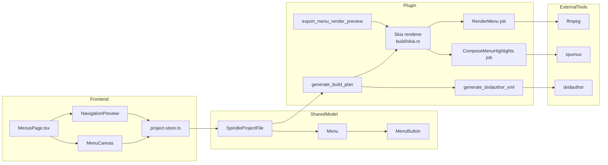
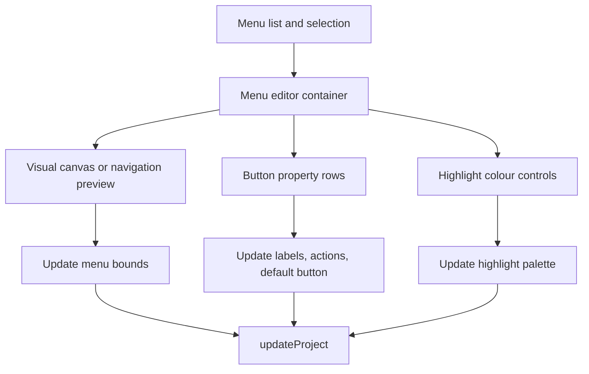
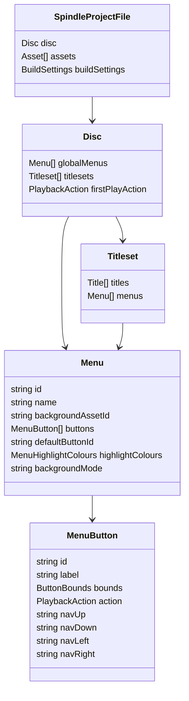
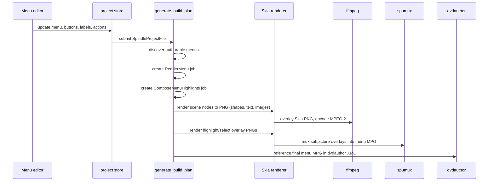

# Menu Builder And Authoring Pipeline

This document explains how Spindle's menu builder works today, how menu data flows from the editor into the project model, and how that model is converted into authored DVD menu MPEG assets.

It focuses on the current still-menu implementation in the modularised `build/` pipeline.

## Scope

This note covers:

- the menu editor architecture in the frontend
- the shared project model used between TypeScript and Rust
- build-plan generation for menu jobs
- the menu-to-MPG and highlight-overlay pipeline
- `dvdauthor` XML generation for menu video and button commands

This note does not attempt to define a future motion-menu architecture in detail. Motion-menu fields already exist in the model, and the current workspace now exposes reserved inspector controls for motion audio and loop settings, but the compiled authored pipeline is still centred on still backgrounds plus highlight overlays.

## Quick View


## High-Level Architecture



## File Map

| Area              | Responsibility                                             | Primary files                                                                                                                     |
| ----------------- | ---------------------------------------------------------- | --------------------------------------------------------------------------------------------------------------------------------- |
| Frontend editor   | Menu editing, button placement, action assignment, preview | `apps/spindle/src/pages/MenusPage.tsx`                                                                                            |
| Frontend state    | Project updates and persistence                            | `apps/spindle/src/store/project-store.ts`                                                                                         |
| Shared TS model   | Menu, button, and playback-action types                    | `apps/spindle/src/types/project.ts`                                                                                               |
| Shared Rust model | Rust-side schema used by the Tauri plugin                  | `plugins/tauri-plugin-spindle-project/src/models.rs`                                                                              |
| Build facade      | Public build API and module wiring                         | `plugins/tauri-plugin-spindle-project/src/build/mod.rs`                                                                           |
| Build planner     | Job discovery and plan assembly                            | `plugins/tauri-plugin-spindle-project/src/build/planner.rs`                                                                       |
| **Skia renderer** | **Scene PNG rendering, font loading, overlay images**      | **`plugins/tauri-plugin-spindle-project/src/build/skia.rs`**                                                                      |
| **Render preview**| **DAR-corrected preview export**                           | **`plugins/tauri-plugin-spindle-project/src/build/preview.rs`**                                                                   |
| Menu authoring    | Build job wiring, spumux XML, button projections           | `plugins/tauri-plugin-spindle-project/src/build/menu.rs`                                                                          |
| DVD authoring     | `dvdauthor` XML and navigation command generation          | `plugins/tauri-plugin-spindle-project/src/build/authoring.rs`, `plugins/tauri-plugin-spindle-project/src/build/dvd_navigation.rs` |
| Build execution   | Subprocess execution and build orchestration               | `plugins/tauri-plugin-spindle-project/src/build/executor.rs`                                                                      |
| Plugin commands   | Tauri command surface                                      | `plugins/tauri-plugin-spindle-project/src/commands.rs`                                                                            |

## Menu Builder Architecture

### 1. The editor is a project-model editor, not a separate menu document system

The menu UI edits `Menu` values directly inside `SpindleProjectFile.disc`.

That means:

- global menus live under `disc.globalMenus`
- titleset menus live under `disc.titlesets[*].menus`
- buttons, navigation, and actions are stored immediately in the shared project model

There is no separate render document, scene graph, or template language yet. The authored menu pipeline consumes the same menu model that the editor mutates.

### 2. The Menus page is made of three conceptual layers



Those layers behave differently:

- the visual canvas edits geometry
- the inspector edits labels, actions, background selection, display-aspect preview, and authored style states
- the preview reuses the same data but changes interaction mode and now surfaces authored button-state styling plus action chips

### 3. Menu actions are stored as playback actions

Each button has an optional `PlaybackAction`. The full set of variants is:

- `playTitle` — jump to a title by ID
- `playChapter` — jump to a specific chapter within a title
- `showMenu` — navigate to another menu by ID
- `setAudioStream` — switch the active audio stream
- `setSubtitleStream` — switch the active subtitle stream (or disable)
- `sequence` — compose multiple actions in order
- `stop` — stop playback
- `return` — return to the calling context

This is important architecturally because the menu editor is not hard-coded to DVD command strings. It stays at the level of authoring intent, and the Rust build pipeline translates that intent into DVD VM commands later. Note that not all variants have a direct DVD VM equivalent — `setAudioStream`, `setSubtitleStream`, and `sequence` are richer than what DVD menus natively support, and translation rules continue to evolve.

### 4. Navigation is geometric plus editable

Directional navigation can come from:

- manual per-button `navUp` / `navDown` / `navLeft` / `navRight`
- auto-generated geometry analysis from the plugin

That means the menu editor owns button layout, but the plugin can still assist with deterministic navigation assignment.

## Data Model

### Core menu entities



### Architectural implication

Because menu data is already normalised into the project model:

- build planning can be deterministic
- diagnostics can reason about menus without scraping UI state
- tests can construct menu scenarios directly in Rust without driving the UI

## Coordinate Model

Menus are authored in a logical design space with square pixels. The renderer scales design coordinates to the output raster at build time using `RenderTarget`.

### Key types

- **`MenuSize`** — the design-space canvas for a menu, in square-pixel display-aspect coordinates. Fields: `width`, `height`, `aspect`. Stored in `MenuDocument.scene.design_size`.
- **`RenderTarget`** — derived at build time from `Disc` settings; never stored in the project file. Fields: `family`, `standard`, `raster_width`, `raster_height`, `sar_num`, `sar_den`.

### Scaling relationship

```
scale_x = raster_width  / design_width
scale_y = raster_height / design_height

button.x_raster = button.x_design × scale_x
button.y_raster = button.y_design × scale_y
```

Coordinates are fractional in design space. Rounding to integer pixels happens once, at render time, in `build/skia.rs`.

### Concrete example: DVD NTSC 16:9

```
Design space:  1024 × 576  (16:9, square pixels)
Render raster:  720 × 480  (NTSC full-D1)
scale_x = 720 / 1024 ≈ 0.703
scale_y = 480 / 576  ≈ 0.833

SAR = (16 × 480) / (9 × 720) = 7680 / 6480, GCD-reduced → 32/27
Display width for preview = 720 × 32/27 ≈ 853px
```

### Format support

| Format  | Default design space | Raster (NTSC) | SAR (16:9) | Overlay mechanism        | UI status     |
|---------|---------------------|---------------|------------|--------------------------|---------------|
| VCD     | 704 × 528           | 352 × 240     | —          | None / player-dependent  | Model only    |
| SVCD    | 800 × 600           | 480 × 480     | —          | Limited, player-dependent| Model only    |
| DVD     | 1024 × 576 (16:9)   | 720 × 480     | 32/27      | MPEG-2 + spumux          | Supported     |
|         | 1024 × 768 (4:3)    | 720 × 480     | 8/9        |                          |               |
| Blu-ray | 1920 × 1080         | 1920 × 1080   | 1/1        | BD IG PNG (stub)         | Model only    |

`DiscFamily::is_ui_supported()` returns `true` only for `DvdVideo`. New variants are wired in the model and render pipeline but are not exposed in the format picker until their full authoring pipelines are complete.

## Build-Plan Architecture

## Animated menu-to-MPG view


### 1. Build planning discovers authorable menus

The planner walks:

- global menus in the VMGM domain
- titleset menus in each VTS domain

Each discovered menu is wrapped in a small domain-aware structure so later steps know:

- which menu is being rendered
- whether it belongs to VMGM or a titleset
- which aspect profile should be used

### 2. Menu jobs are split into two authored stages

For each menu, the build plan emits:

1. `RenderMenu`
2. `ComposeMenuHighlights`

That split is intentional:

- the base menu video is rendered first as MPEG-2
- subpicture highlight/select overlays are generated separately
- `spumux` then combines the overlays with the menu video into the authored menu MPG

### 3. The planner remains declarative

The build plan is just data:

- job labels
- output paths
- commands
- generated XML blobs

That lets the UI preview the plan before execution and keeps runtime execution logic simpler.

## Menu-To-MPG Pipeline



### Stage A. Base menu render

The still-menu render path does the following:

1. **Skia scene render** (`build/skia.rs`): the menu scene (shapes, text nodes, image assets, button hints) is rendered to a PNG at raster resolution. Design-space coordinates are scaled to raster coordinates using `scale_x = raster_width / design_width` and `scale_y = raster_height / design_height`.
2. **ffmpeg compose and encode**: ffmpeg overlays the Skia PNG onto any background asset, then encodes the result as MPEG-2 with the correct SAR.

This produces a `_base.mpg` file.

### Stage B. Overlay image generation

Before `spumux` runs, the pipeline generates:

- highlight PNG
- select PNG

These images are transparent except for button outline strokes, drawn by Skia. They are the subpicture overlays consumed by DVD players for button highlight and select states.

### Stage C. `spumux` composition

The planner generates a `spumux` XML document that contains:

- highlight image path
- select image path
- button rectangles
- directional navigation references

`spumux` reads the base menu MPG, adds the subpicture streams, and writes the final menu MPG used by `dvdauthor`.

## DVD Authoring Architecture

### Menu video and commands are authored separately

The final DVD menu needs two distinct things:

- a menu MPG asset
- valid DVD VM commands for buttons and post actions

Spindle handles these in different phases:

- ffmpeg and spumux create the menu video asset
- `generate_dvdauthor_xml` emits the `<pgc>`, `<vob>`, and `<button>` command structure

### Domain-aware command generation

Menu routing is sensitive to DVD VM context, so the command generator distinguishes:

- VMGM menu context
- titleset menu context
- title post-action context

That is why `PlaybackAction` is translated late. The legal DVD command depends on where the action executes, not just on the target.

### Current command rules in the implementation

- menu -> menu uses `jump`
- title -> menu uses `call`
- VMGM -> title uses disc-global `jump title N`
- titleset-local title/chapter targets use local title numbering
- non-root titleset menu targets are reached through a titleset `root` entry plus `g0` dispatch when needed
- title returns into titleset menus are authored as `call ... menu entry root` instead of illegal direct titleset menu PGC calls
- menu entry PGCs explicitly set the DVD `button` register so keyboard focus is deterministic on entry
- invalid cross-titleset title/chapter routes are rejected during planning

## Current Visual Behaviour

The Skia renderer (`build/skia.rs`) produces the following for each menu:

- background fill (solid colour or background asset)
- `SceneNode::Shape` — filled rectangles at raster-scaled coordinates
- `SceneNode::Text` — rendered via Skia with `font_weight`, `font_italic`, `letter_spacing`, and `text_decoration` (underline) applied; font family resolved from project font assets with system fallback; font size clamped to per-format minimum (see format table above)
- `SceneNode::Image` — asset images scaled to raster bounds
- button outline hints (the select-colour outline and label for the default button)
- highlight and select overlay PNGs (transparent except for button outlines, used by `spumux`)

Motion-menu authoring, advanced text shaping (multi-line layout, ligatures), and Blu-ray IG stream assembly are not yet authored end-to-end.

## Failure Boundaries And Diagnostics

### Frontend layer

The frontend can produce:

- invalid or incomplete menu data
- dangling menu targets
- awkward geometry or overlapping button states

These are mostly caught by validation and by build-time command generation.

### Current automated coverage

The Rust test suite covers the tricky menu-navigation cases that were most likely to regress:

- VMGM to titleset root-entry jumps
- `g0`-dispatched jumps to later titleset menus
- title post returns to same-titleset and cross-titleset menus
- menu entry initialisation for explicit defaults and first-button fallback

There is also an ignored smoke test in `build/executor.rs` that runs a tiny `ffmpeg -> spumux -> dvdauthor` build and verifies that `VIDEO_TS` output is authored successfully. It is intended for container or CI environments that already provide the external DVD toolchain.

### Planner layer

The planner can fail when:

- a referenced background asset cannot be found
- a playback target cannot be resolved
- a routing pattern would produce an illegal DVD VM command

This is the right place to fail for authoring-rule violations, because it keeps those problems visible before `dvdauthor` starts.

### Tool-execution layer

The external tools can fail when:

- ffmpeg cannot render the menu video
- ffmpeg cannot render overlay images
- spumux rejects the overlay XML or button geometry
- dvdauthor rejects the final command structure

The recent audit work added more routing tests specifically to reduce the last category.

## Architecture Strengths

- one shared project model drives both editor and authoring pipeline
- menu jobs are visible in the build plan instead of being hidden backend work
- routing logic is now covered by a denser Rust test matrix
- menu rendering is decomposed into stages that are easier to debug

## Font Resolution

### Priority order

The Skia renderer resolves font families in the following priority order for every text node:

1. **Project asset fonts** — font files (`.ttf`, `.otf`, `.woff`, `.woff2`) registered in `SpindleProjectFile.assets`. These are loaded by Skia at render time from their `source_path`.
2. **Application sidecar fonts** — fonts bundled alongside the app binary in `src-tauri/fonts/`. This tier is reserved for future use; no fonts are bundled in the current release. The directory is tracked as an empty stub (`src-tauri/fonts/.gitkeep`).
3. **System fonts** — discovered via Skia's `FontMgr` on the build host. On the canonical `ghcr.io/liminal-hq/tauri-dev-desktop` container, the available system families are: **DejaVu Sans**, **DejaVu Sans Mono**, **DejaVu Serif**, and **Noto Color Emoji**.

If no match is found for a given family name, Skia falls back to its default typeface.

### `enumerate_fonts` helper

The font enumeration logic lives in `build/skia.rs` as the public `enumerate_fonts` function:

```rust
pub fn enumerate_fonts(assets: &[&Asset]) -> Vec<FontEntry>
```

It returns a deduplicated list of `FontEntry` values in priority order. `FontEntry` carries:

- **`family`** — the display name shown in the UI (e.g. `"DejaVu Sans"`)
- **`source`** — one of `project-asset`, `app-sidecar`, or `system`

`FontCache::new()` is built on the same project-asset scan as `enumerate_fonts`, so both paths share the same font-loading logic.

### `list_available_fonts` command

The `list_available_fonts` Tauri command exposes font enumeration to the frontend:

```
plugin:spindle-project|list_available_fonts
```

**Payload:** `{ project: SpindleProjectFile }`  
**Response:** `FontEntry[]`

The UI calls this command once when a menu is selected (or when `project.assets` changes) and uses the result to populate the font-family dropdown in the inspector panel.

### UI dropdown

`TextStyleSection` in `InspectorPanel.tsx` accepts an optional `availableFonts?: FontEntry[]` prop. When provided, the dropdown renders `<optgroup>` sections:

- **Project fonts** — entries with `source === 'project-asset'`
- **Application fonts** — entries with `source === 'app-sidecar'`
- **System fonts** — entries with `source === 'system'`

Empty tiers are omitted. When `availableFonts` is `undefined` (command not yet resolved or failed), the dropdown falls back to the hardcoded list (`Space Grotesk`, `Inter`, `System UI`, `Georgia`, `Courier New`).

The load is best-effort: if `list_available_fonts` fails (e.g. during development without a project loaded), the error is logged and the hardcoded fallback is used.

## Render Preview

The `export_menu_render_preview` command lets designers export a preview PNG during authoring — without running a full build.

### What it produces

A single PNG at display-aspect dimensions. The preview shows what the menu will look like after MPEG encode, with non-square-pixel SAR corrected:

```
raster PNG (720 × 480 for DVD NTSC)
    ↓  scale display_width = raster_width × sar_num / sar_den
preview PNG (853 × 480 for DVD NTSC 16:9)
```

For formats with square pixels (SAR 1:1, currently only Blu-ray) no scaling is applied.

### When to use it

- After authoring a menu, before triggering a full build, to confirm layout and text rendering
- When debugging coordinate scaling or font rendering on a target format

### Frontend

"Export Render Preview" appears in the inspector panel **Render Preview** section when no scene node is selected and the menu has an authored document. Clicking it opens a save-file dialog and calls the backend command.

## Architecture Constraints

- motion-menu fields exist ahead of full motion-menu authoring
- multi-line text layout and advanced font shaping are not yet implemented
- DVD VM routing remains domain-sensitive and must stay heavily tested
- Blu-ray IG stream assembly is a stub; full BD authoring is follow-on work

## Suggested Next Improvements

1. Implement multi-line text layout for text nodes that exceed their bounding box.
2. Add a visual regression fixture comparing Skia PNG output across format targets.
3. Add tests for fallback behaviour when menu targets are missing.
4. Decide how motion-menu timing, looping, and timeout behaviour should map into authored jobs.
5. Complete Blu-ray IG stream assembly (currently a Skia-wired stub).
