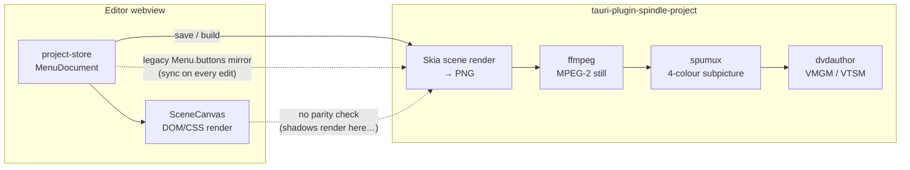
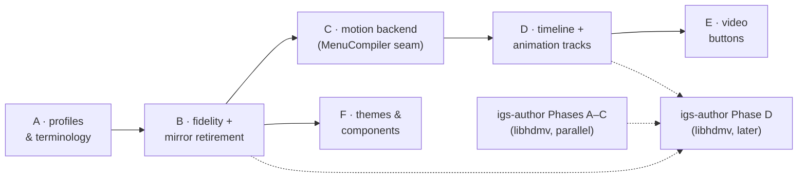

# Rich Menu Editor Plan — motion, imagery, animated buttons, and BD-ready foundations

**Status:** planning · July 2026 · reviewed against Spindle v0.3.0

This document plans the next generation of the menu authoring system: motion
backgrounds, animated buttons, richer imagery and styling, timeline editing,
and — critically — the design decisions that must be made _now_ so the same
editor can author BDMV (Blu-ray) menus later without a rewrite.

It builds on, and does not replace:

- [`motion-menus.md`](motion-menus.md) — DVD motion-menu pipeline detail
  (spumux/dvdauthor mechanics, validation rules, ffmpeg filter graphs)
- [`blu-ray-integration-plan.md`](blu-ray-integration-plan.md) — the full BD/UHD
  backend programme (phases 1–8)
- [`lib-igs-author-plan.md`](lib-igs-author-plan.md) — IGS authoring library
- [`initial-planning/dvd_bd_architecture_note.md`](initial-planning/dvd_bd_architecture_note.md)
  — the layering rule this plan follows: _share the authoring language, not the
  compiler_

Where those documents describe backends, this one describes the **authored
model, the editor, and the seams between them and the backends**.

---

## 1. Current state review

### What works today (v0.3.0)

- **Authored model** (`plugins/tauri-plugin-spindle-project/src/models/menu.rs`):
  `MenuDocument` cleanly separates scene graph, interaction graph, timing, and
  compile policy. Design-space coordinates scale to the raster at compile time.
  The model already contains per-state button styles (`ButtonStyleMap`), motion
  timing (`MenuTiming`), animated highlight keyframes, `SceneNode::Video`,
  `Group`, `ComponentInstance`, `GeneratedCollection`, and `theme_ref`.
- **Editor** (`apps/spindle/src/components/menus/`): drag/resize/snap canvas
  with safe areas, text/image/shape/button tools, per-state button styling
  including shadows and glows, remote-navigation preview with select/activate
  simulation, DVD-safe compile preview, menu map, and chapter/audio/subtitle
  menu generators.
- **DVD build** (`src/build/`): Skia renders the scene to a PNG, ffmpeg
  composites it over the background and encodes an MPEG-2 still, and highlights
  are emitted as a 4-colour subpicture overlay.

### Today's pipeline, and where it diverges



The two dotted edges are the structural problems: the legacy mirror keeps a
second model alive that cannot express the roadmap below, and nothing forces
the DOM render and the Skia render to agree.

### The gap: the model is two phases ahead of everything else

| Capability                                   | Model              | Editor                             | DVD build                               |
| -------------------------------------------- | ------------------ | ---------------------------------- | --------------------------------------- |
| Text / image / shape nodes                   | ✅                 | ✅                                 | ✅                                      |
| Button styles — `normal` state               | ✅                 | ✅                                 | ✅                                      |
| Button styles — `focus`/`activate`           | ✅                 | ✅ (state preview toggle)          | ❌ only `normal` is rendered            |
| Shadows / glows (`ButtonShadowType`)         | ✅                 | ✅ (CSS `box-shadow`)              | ❌ never drawn by Skia                  |
| `Group` nodes                                | ✅                 | ❌ filtered out of the canvas      | ❌ skipped (`skia/scene.rs`)            |
| `Video` nodes                                | ⚠️ no width/height | ❌ invisible                       | ❌ skipped                              |
| `ComponentInstance` / `GeneratedCollection`  | ✅ enum arms       | ❌                                 | ❌ skipped                              |
| Motion background (mode/duration/loop/audio) | ✅                 | ✅ inspector fields                | ❌ planner rejects motion menus         |
| Highlight keyframes                          | ✅                 | ❌ dropdown only, no keyframe UI   | ❌                                      |
| Button `videoAssetId` (motion tile)          | ✅                 | ❌ no UI                           | ❌ video backgrounds trimmed to frame 1 |
| Themes (`theme_ref`)                         | ✅                 | ❌ Templates rail is an empty stub | ❌                                      |

Two structural warts amplify the gap:

1. **The legacy `Menu.buttons` mirror.** Every edit syncs the authored document
   back to the flat pre-scene button model (`project-store.ts`, sync layer in
   `updateMenuDocument`). It keeps old readers alive but is the source of
   drift bugs (issue #29) and structurally cannot express anything on the
   roadmap below.
2. **Editor/build render divergence.** The editor renders with DOM/CSS, the
   build renders with Skia, and nothing enforces parity. Shadows are the
   proof: authored, previewed, silently dropped from the disc.

---

## 2. What BDMV changes, and why it shapes decisions now

HDMV Interactive Graphics menus (the realistic BD target — see
`lib-igs-author-plan.md`) are structurally _richer_ than DVD in exactly the
directions this plan pursues:

- **Button states are full bitmaps, not colour overlays.** Normal / selected /
  activated each get their own image, and each state can be an **animated
  frame sequence**. DVD's 4-colour subpicture highlight is the degenerate
  case, not the general model.
- **256-colour palettized graphics** at up to 1920×1080, square pixels, BT.709.
- **Popup menus over playing video** — a menu is not necessarily a place you
  navigate to; it can be an overlay on playback.
- Multi-page menus in one stream, button **sound effects**, page in/out
  transition effects, and a richer navigation VM.

Everything "rich" the user wants (motion, imagery, animated buttons) is
_native_ on BD and _emulated_ on DVD. Therefore: **the authored model
expresses the rich intent; each format backend owns the degradation.**

### Design decisions (binding for the slices below)

1. **Button states are fully rendered visuals; DVD-ness is a compile policy.**
   The Skia renderer must be able to render _any_ state of any button — DVD
   uses that for its compile preview and to derive the subpicture; BD will
   emit per-state bitmaps directly.
2. **Animation is deterministic keyframed property tracks**, evaluated by one
   Rust implementation that the compiler and the editor preview both agree
   with (parity-tested, same approach as scene rendering). BD lowers tracks to
   sampled bitmap frames; DVD lowers them to subpicture display-control
   sequences (DCSQ palette updates). Nothing browser-only (CSS transitions,
   open-ended easing) goes into the model. `HighlightKeyframe` becomes a
   special case of this system, not a parallel one.

   ```rust
   /// A keyframed animation on one property of one scene node (or button
   /// state). Every track is offline-sampleable: `evaluate(t)` is pure and
   /// deterministic, so the editor preview, the DVD DCSQ compiler, and the
   /// BD frame-sequence sampler all agree by construction.
   #[derive(Debug, Clone, Serialize, Deserialize)]
   #[serde(rename_all = "camelCase")]
   pub struct AnimationTrack {
       pub node_id: String,
       pub target: AnimatableProperty,
       pub keyframes: Vec<Keyframe>, // sorted by timestamp_secs
   }

   #[derive(Debug, Clone, Copy, Serialize, Deserialize)]
   #[serde(rename_all = "kebab-case")]
   pub enum AnimatableProperty {
       HighlightColour,   // DVD: DCSQ palette update · BD: state frames
       HighlightOpacity,  // DVD: DCSQ contrast update · BD: state frames
       Opacity,           // BD only (DVD diagnostics flag it)
       Position,          // BD only
   }

   #[derive(Debug, Clone, Serialize, Deserialize)]
   #[serde(rename_all = "camelCase")]
   pub struct Keyframe {
       pub timestamp_secs: f64,
       pub value: KeyValue, // colour | scalar | point
       pub easing: Easing,  // closed set — see below
   }

   /// Closed easing set. Every member must be implementable in the Rust
   /// evaluator AND cheaply in the webview preview. No cubic-bezier free-for-all.
   #[derive(Debug, Clone, Copy, Serialize, Deserialize, Default)]
   #[serde(rename_all = "kebab-case")]
   pub enum Easing {
       #[default]
       Linear,
       Hold,     // step function — required for DCSQ, which cannot interpolate
       EaseIn,
       EaseOut,
       EaseInOut,
   }
   ```

   How one authored track reaches each disc format:

   ```mermaid
   flowchart TD
       T["AnimationTrack\nhighlightColour: 0s #ffaa40 → 5s #ff4040"]
       EV["Rust evaluator\nevaluate(track, t)"]
       T --> EV
       EV -->|"sample at keyframe times\n(Hold semantics)"| DCSQ["DVD: spumux multi-&lt;spu&gt;\nDCSQ palette updates"]
       EV -->|"sample at frame rate\n(e.g. 23.976 fps)"| IGS["BD: per-state bitmap\nframe sequence → igs-author"]
       EV -->|"requestAnimationFrame\n(same evaluate, TS port + parity tests)"| PREV["Editor: animated\nPreview mode"]
   ```

   The DVD lowering is lossy by design (palette/contrast only, hold-steps);
   the diagnostics layer says exactly what survives, per Section 3.3.

3. **Menus carry a semantic role, not just a physical domain.** `MenuDomain::
Vmgm | Titleset` is DVD's physical layout leaking into authored intent.
   Menus gain a `role` (root, title-select, chapter, setup, popup, extras);
   the DVD backend maps role → VMGM/VTSM placement, the BD backend maps role →
   Top Menu / popup IG stream. This reconciles with `blu-ray-integration-plan.md`
   §1.7 (`BdMenuType`) — role is the shared concept, `BdMenuType` and
   `MenuDomain` become backend mappings of it.

   ```rust
   /// What the user means this menu to be. Backends map role → physical
   /// placement; the terminology layer maps role → on-screen wording.
   #[derive(Debug, Clone, Copy, PartialEq, Eq, Serialize, Deserialize)]
   #[serde(rename_all = "kebab-case")]
   pub enum MenuRole {
       Root,        // DVD: VMGM title menu   · BD: Top Menu
       TitleSelect, // DVD: VMGM or VTSM      · BD: Top Menu page
       Chapter,     // DVD: VTSM (per group)  · BD: playlist menu page
       Setup,       // DVD: VTSM              · BD: Top Menu page
       Extras,      // DVD: VTSM              · BD: Top Menu page
       Popup,       // DVD: unsupported (validation error) · BD: popup IG
   }
   ```

   `MenuDocument.role` is authoritative; `MenuDomain` stays only as the DVD
   backend's placement output. Existing projects infer a role on load, in
   order: generator metadata → `Chapter`/`Setup`; then, among `Vmgm` menus,
   only the disc's entry menu (the default/first global menu a player reaches
   via the title-menu key) → `Root` — a project can hold several VMGM pages
   (title-select, extras), and all remaining `Vmgm` menus infer `TitleSelect`;
   all other titleset menus → `TitleSelect`. Inference is a one-time default —
   the inspector lets the user reassign any role afterwards.

4. **Constraint profiles, not constants.** Button limits, palette depth,
   raster, safe-area, and minimum font sizes become a per-format data table
   consumed by diagnostics, the compile preview, and validation — replacing
   hardcoded `MAX_DVD_BUTTONS = 36`, `DVD_PALETTE_COLOURS = 4`
   (`CompileMode.tsx`) and `MENU_WIDTH = 720` (`SceneCanvas.tsx`).
5. **The editor speaks design-space only.** Retire the legacy `buttons` mirror
   and the 720-raster remnants; the authored document (already
   resolution-agnostic, with a 1920×1080 BluRay arm in `MenuSize::default_for`)
   becomes the single model.
6. **Actions stay semantic.** `PlaybackAction` ports to BD's VM as-is. Popup
   show/hide, button sounds, and auto-action buttons are additive later.
7. **A `MenuCompiler` backend boundary is carved during the motion slice** —
   scene render → per-state assets → format mux — so ffmpeg/dvdauthor
   specifics stop spreading into shared code and a BD backend becomes "add a
   backend", not "untangle the DVD one".
8. **Flagged, no action yet:** colour management (author in sRGB, convert
   per-target: BT.601 for DVD, BT.709 for BD) and background transparency for
   popup menus (the model's `Option`s already permit a "no background" menu).

---

## 3. Disc-aware UI: the editor reflects the target format

The project already knows its `DiscFamily`; the menu workspace should wear it.
The user should always see **which disc they are making, in that disc's
language, with an honest preview of what the disc will actually do.**

### 3.1 Format context chrome

- The menu editor header already shows `16:9 anamorphic DVD · 720 × 480 NTSC`.
  Generalise this into a **format badge** sourced from the constraint profile:
  DVD shows raster/standard/aspect; BD will show `1920 × 1080 · 23.976p ·
BD-25`. The badge is also the entry point to the compile-policy inspector.

  ```text
  DVD project                              BD project (later)
  ┌──────────────────────────────────┐    ┌──────────────────────────────────┐
  │ ☰ Menus   Main Menu              │    │ ☰ Menus   Top Menu               │
  │ ● DVD-Video · 720×480 NTSC ·     │    │ ● BDMV · 1920×1080 · 23.976p ·   │
  │   16:9 anamorphic · VMGM         │    │   BD-25 · Top Menu               │
  │ [Safe Area][DVD Preview][Preview]│    │ [Safe Area][BD Preview][Preview] │
  └──────────────────────────────────┘    └──────────────────────────────────┘
  ```

- Diagnostics, planner rows, and validation messages quote the profile's
  limits ("36-button DVD limit", "4-colour subpicture palette") rather than
  bare numbers, so the same message renders correctly for BD ("255-button IG
  page limit", "256-colour palette").

### 3.2 Format terminology

UI copy comes from a per-family terminology map (a small frontend module keyed
by `DiscFamily`, colocated with the constraint profile):

| Concept (shared model)   | DVD-Video term       | BDMV term            |
| ------------------------ | -------------------- | -------------------- |
| Root menu role           | VMGM / Title Menu    | Top Menu             |
| Per-group menu role      | Titleset (VTSM) menu | Playlist menu        |
| Overlay-on-video role    | — (not supported)    | Popup Menu           |
| Focus/activate treatment | Subpicture highlight | Button state bitmaps |
| Highlight palette        | 4-colour CLUT        | 256-colour palette   |
| Menu video unit          | Motion menu VOB      | IG stream + clip     |
| Grouping unit            | Titleset             | Playlist             |

The editor never invents a neutral vocabulary that satisfies neither format —
per `dvd_bd_architecture_note.md`, shared concepts live in the model, but the
_words on screen_ are the target format's.

```typescript
// apps/spindle/src/format/terminology.ts (new)
export interface FormatTerminology {
	menuRole: Record<MenuRole, string>;
	highlightTreatment: string; // 'Subpicture highlight' | 'Button state bitmaps'
	highlightPalette: string; // '4-colour CLUT' | '256-colour palette'
	groupingUnit: string; // 'Titleset' | 'Playlist'
	compilePreviewLabel: string; // 'DVD Preview' | 'BD Preview'
}

export function terminologyFor(family: DiscFamily): FormatTerminology { ... }
```

Components stop writing `"DVD Preview"` inline and render
`terminologyFor(project.disc.family).compilePreviewLabel` — mechanical, but it
is the difference between "BD support means a new profile row" and "BD support
means auditing every string in `components/menus/`".

### 3.3 Honest target preview

- **Compile preview becomes profile-driven.** `CompileMode` currently
  hardcodes the DVD treatment; it becomes a renderer parameterised by the
  constraint profile: DVD shows the 4-colour-quantised subpicture look, BD
  will show full-colour state bitmaps.
- **Preview modes are labelled with the format**: "DVD Preview" stays, and the
  toggle group is generated from the active profile so a BD project shows
  "BD Preview" with BD behaviours (e.g. popup overlay preview).
- **Unsupported-on-target authoring degrades visibly, not silently.** If an
  authored feature can't survive the target compile (e.g. a gradient that
  quantises badly to the DVD palette, a popup role on a DVD project), the
  canvas and diagnostics say so at authoring time — the same mechanism that
  today warns about safe areas.

This section is deliberately implementable _now_ against DVD only: the profile
table has one row, but everything that reads it stops assuming DVD.

---

## 4. Implementation slices

Each slice is independently shippable and lists what it must do differently
because of Section 2.

### Slice A — Format profile & terminology layer

**Goal:** the UI reflects the disc type; DVD-isms move from constants into data.

- Add a `FormatProfile` (Rust, serialised to the frontend alongside the
  project): raster, design-size defaults, max buttons per menu/page, palette
  model (`FourColourSubpicture` | `Palette256`), min font size, safe-area
  defaults, supported menu roles, supported background modes.

  ```rust
  /// Format law as data. One row per DiscFamily; consumed by diagnostics,
  /// CompileMode, validation, and the canvas chrome. Replaces scattered
  /// constants like MAX_DVD_BUTTONS / DVD_PALETTE_COLOURS / MENU_WIDTH.
  #[derive(Debug, Clone, Serialize)]
  #[serde(rename_all = "camelCase")]
  pub struct FormatProfile {
      pub family: DiscFamily,
      pub display_name: &'static str,        // "DVD-Video", "BDMV"
      pub design_sizes: &'static [MenuSize], // per aspect
      pub max_buttons_per_menu: u32,         // 36 | 255
      pub highlight_model: HighlightModel,
      pub min_font_size_pt: f32,             // already per-family in skia/fonts
      pub supported_roles: &'static [MenuRole],
      pub supported_background_modes: &'static [BackgroundMode],
      pub supports_state_animation: bool,    // false (DCSQ-only) | true (IGS)
  }

  #[derive(Debug, Clone, Copy, Serialize)]
  #[serde(rename_all = "kebab-case")]
  pub enum HighlightModel {
      /// DVD: one subpicture overlay, 4-colour CLUT, palette-only animation.
      FourColourSubpicture,
      /// BD: per-state 256-colour bitmaps, frame-sequence animation.
      StateBitmaps256,
  }

  pub fn profile_for(family: DiscFamily) -> &'static FormatProfile { ... }
  ```

- Add the terminology map (frontend) keyed by `DiscFamily` (Section 3.2).
- Drive `CompileMode`, `inspectorDiagnostics.ts`, and canvas chrome from the
  profile; delete `MAX_DVD_BUTTONS`, `DVD_PALETTE_COLOURS`, `MENU_WIDTH`
  constants.
- Format badge in the menu editor header and menu rail.

**BD-readiness:** this is the seam BD plugs into (`blu-ray-integration-plan.md`
§1.9's conditional UI becomes "add a profile row").

### Slice B — Visual fidelity foundation

**Goal:** what you author is what the disc shows; richer still imagery.

- Skia renders **any button state** (normal/focus/activate), shadows and
  glows, and `Group` nodes (position offset + z-order container). The DVD
  compiler keeps consuming `normal` plus subpicture, but the compile preview
  and render-preview export can now show true focus/activate appearance.
- New shared visual properties on positioned scene nodes: opacity, rotation,
  corner radius (shape/image), 2-stop linear gradient fill, image fit/crop.
  Implemented in **both** renderers in the same PR — a renderer-parity golden
  test (existing render-preview export vs DOM snapshot) is the acceptance
  gate, so the shadow-class divergence cannot recur.
- Give `SceneNode::Video` width/height and render its poster frame in both
  renderers (still menus render the poster; motion consumes it in Slice E).
- **Retire the legacy `Menu.buttons` mirror**: migrate remaining readers
  (planner, validation, compiler fallback) onto `authored_document`, keep the
  one-time `migrate_to_document` lift on load, delete the write-back sync.

Intersecting issues: #28, #29, #53, #55, #63, #64.

### Slice C — Motion menu backend

**Goal:** motion backgrounds and audio beds actually build; the plan-time
block is removed.

- Implement the pipeline in `motion-menus.md` (loop-segment extraction from
  `loopStartSecs`, scene PNG composited over looping video, AC-3 audio bed,
  intro cell + loop cell with `<post>` jump, loop-count/timeout via g-register
  post-commands).
- Carve the **`MenuCompiler` boundary** while writing it: trait with
  `render_states → compose_background → mux` stages; the DVD implementation is
  the only one, but ffmpeg/dvdauthor types stop appearing in shared build code.

  ```rust
  /// Format backend seam for menu compilation. Stage 1 is shared (Skia);
  /// stages 2–3 are format law. The BD implementation slots in later with
  /// igs-author + tsMuxeR without touching shared build code.
  pub trait MenuCompiler {
      /// Shared: render every button state + base scene via Skia.
      /// Animation tracks are sampled here when the profile supports it.
      fn render_states(
          &self,
          doc: &MenuDocument,
          assets: &AssetMap,
      ) -> Result<RenderedMenu>; // base PNG + per-state, per-button bitmaps

      /// Format-specific: produce the menu's video/background unit.
      /// DVD: ffmpeg still or looping MPEG-2 PS.  BD: H.264 clip.
      fn compose_background(
          &self,
          rendered: &RenderedMenu,
          timing: &MenuTiming,
      ) -> Result<ComposedBackground>;

      /// Format-specific: attach interactivity and emit muxable output.
      /// DVD: spumux subpicture + dvdauthor PGC.  BD: IGS stream + tsMuxeR.
      fn mux(
          &self,
          composed: &ComposedBackground,
          interaction: &MenuInteractionGraph,
      ) -> Result<CompiledMenu>;
  }
  ```

  ```mermaid
  flowchart TD
      DOC["MenuDocument\n(scene · interaction · timing · role)"]
      RS["render_states (shared, Skia)\nbase scene + per-state bitmaps\n+ sampled animation frames"]
      DOC --> RS

      RS --> DVDC["DVD backend\ncompose: ffmpeg MPEG-2\nmux: spumux + dvdauthor"]
      RS --> BDC["BD backend (later)\ncompose: H.264 clip\nmux: igs-author + tsMuxeR"]

      DVDC --> VOB["VIDEO_TS"]
      BDC --> M2TS["BDMV"]
  ```

- Planner: replace the "switch these menus back to still mode" error with real
  motion jobs (capacity model already estimates motion sizes).
- Editor: motion settings stay in the inspector but gain a working
  scrub-preview of the background video (`<video>` + `convertFileSrc`) so loop
  points can be set against real frames.

### Slice D — Timeline & animated highlights

**Goal:** a real timeline in the editor; keyframed animation that compiles.

- **Timeline strip** under the canvas (visible when the menu is motion, or
  when any animation track exists): intro region, loop region, scrubber,
  per-node keyframe lanes.

  ```text
  ┌─ Canvas ────────────────────────────────────────────────────────────────┐
  │                        (scene, scrubbed to 7.2 s)                       │
  └──────────────────────────────────────────────────────────────────────---┘
  ┌─ Timeline ──────────────────────────────────────────────────────────────┐
  │        0s      2s      4s      6s   ▼7.2s   10s     12s     14s         │
  │ ▐ intro ▌▐──────────────── loop (2.0 s → 14.0 s) ────────────────▌      │
  │ ♪ audio  ▐████████████████████ bed.ac3 ██████████████████████▌          │
  │ ▸ Play All   highlightColour  ◆────────◆─────────────◆                  │
  │ ▸ Chapters   highlightOpacity ◆──────────────◆                          │
  │ ▸ tile-3     video            ▐■■■■■■ chapter3.mp4 (poster 00:12) ■■▌   │
  └──────────────────────────────────────────────────────────────────────---┘
     ◆ = keyframe (drag to retime; double-click to edit value/easing)
  ```

- **Property-track animation model** (design decision 2): keyframes + fixed
  easing set, evaluated in Rust; editor preview evaluates the same tracks
  (parity-tested). First lowered targets: highlight colour/opacity → spumux
  multi-`<spu>` sequences per `motion-menus.md`. spumux's `image`/`select`/
  `highlight` attributes take overlay **bitmap paths**, not colours — each
  keyframe's colour/opacity is baked into per-keyframe rendered overlay PNGs
  (as the existing still-menu builder already does for its single overlay). A
  pulsing highlight (`0s → #ffaa40@0.6`, `1s → #ffaa40@0.2`,
  `2s → #ffaa40@0.6`, Hold easing, sampled at keyframes) lowers to:

  ```xml
  <!-- hl_k*_sel.png / hl_k*_hl.png are rendered per keyframe with the
       sampled colour+opacity baked into the indexed-PNG palette -->
  <spu start="00:00:00.000" end="00:00:01.000"
       image="hl_k0.png" select="hl_k0_sel.png" highlight="hl_k0_hl.png" />
  <spu start="00:00:01.000" end="00:00:02.000"
       image="hl_k1.png" select="hl_k1_sel.png" highlight="hl_k1_hl.png" />
  <spu start="00:00:02.000" end="00:00:14.000"
       image="hl_k2.png" select="hl_k2_sel.png" highlight="hl_k2_hl.png" />
  ```

  If per-keyframe overlay swaps prove too coarse or bloaty in practice, the
  fallback is a lower-level DCSQ writer emitting palette/contrast updates
  directly (bypassing spumux for menus with animated tracks) — the DCSQ
  player-compatibility research issue covers evaluating both routes.

- Keyframe editor UI replaces the dead Static/Animated dropdown; Preview mode
  animates highlights over the loop.
- Migration: existing `HighlightKeyframe` arrays lift into tracks on load.

**BD-readiness:** tracks must be offline-sampleable at any timestamp — that is
exactly what IGS frame-sequence generation needs (`lib-igs-author-plan.md`
Phase B).

### Slice E — Motion thumbnails / video buttons

**Goal:** the classic "moving chapter tile" idiom.

- Button `videoAssetId` and `SceneNode::Video` get compiled: ffmpeg `overlay`
  chains composite per-button video into the motion background at button
  bounds (approach 2 in `motion-menus.md`), beneath a standard highlight.
- Editor: video asset picker on buttons/video nodes, poster-frame display,
  scrub-on-hover; timeline scrubbing shows composited motion.
- Generators: chapter grids can opt into motion tiles sourced from the
  existing thumbnail/preview cache timestamps.

### Slice F — Themes & components

**Goal:** `theme_ref` and the Templates rail stop being stubs; generated menus
restyle without regeneration.

- Theme document: typography set, button `ButtonStyleMap`, highlight palette,
  spacing tokens, background treatment. `theme_ref` resolves against project
  themes; unset properties inherit from the theme.

  ```jsonc
  // A theme is data the existing style structs already understand —
  // no new rendering capability, only a resolution layer.
  {
  	"id": "theme-archival",
  	"name": "Archival",
  	"typography": {
  		"heading": { "fontFamily": "Inter", "fontSize": 42, "fontWeight": "bold" },
  		"label": { "fontFamily": "Inter", "fontSize": 16 },
  	},
  	"buttonStyle": {
  		/* ButtonStyleMap: normal / focus / activate */
  	},
  	"highlightColours": { "selectColour": "#ffaa40", "selectOpacity": 0.6 },
  	"spacing": { "gridGap": 24, "buttonPaddingH": 16 },
  	"background": { "colour": "#101014" },
  }
  ```

  Resolution order per property: explicit node override → component default →
  theme token → model default. Only the explicit override is stored in the
  scene, which is what makes re-theming and regeneration non-destructive.

- Templates rail lists starter themes; applying one is undoable and
  non-destructive (explicit overrides survive).
- Generators become theme-aware (SPEC §14.8) and emit `generation_meta` so
  regeneration preserves overrides.
- `ComponentInstance` implemented for the SPEC's `HeroTitleButton` and
  `ChapterThumbnailTile` as the first components.

### Menu role model (lands with whichever of A/C ships first)

- Add `role` to `MenuDocument` (root, title-select, chapter, setup, extras,
  popup); infer roles for existing menus from domain + generator metadata.
- DVD backend maps role → `MenuDomain`; generators and the menu map group by
  role; the terminology map renders role names per format.
- `popup` is authorable only when the profile supports it (no profile does
  until BD lands) — but the model, map view, and generators understand it now.

---

## 5. Companion library review — `igs-author` (libhdmv)

`lib-igs-author-plan.md` proposes the BD equivalent of the spumux pipeline:
compile authored menus into IGS elementary streams, as
`libhdmv/crates/igs-author`. It is the right next companion crate — it is the
consumer of everything Slices B and D produce — but reviewing it against the
**actual state of libhdmv** (checked July 2026) and against this plan's
decisions surfaces four corrections:

1. **The `igs` crate is decode-only today.** The plan states libhdmv "can
   encode individual segments (palette, object)" and Phase A builds on
   `igs::write_object_segment` / `igs::write_palette_segment` — neither exists
   anywhere in the repo. `pgs::rle::encode_rle` ✅ and the `hdmv-insn` encoder
   (`encode`, `jump_object`, `play_playlist`, `set_button_page`, …) ✅ are
   real, but IGS **segment writers are new work** and belong at the front of
   Phase A (or a Phase A0), which moves its estimate accordingly.
2. **Phase D integrates from the wrong model.** The converter is specified as
   `Menu` + `MenuButton` → `AuthorPage` — the legacy flat model this plan
   retires in Slice B. Phase D should consume `MenuDocument` (scene +
   interaction + role) and **pre-rendered per-state RGBA bitmaps** from the
   Spindle Skia renderer. This also resolves the plan's research question 5 in
   the direction it already recommends: igs-author takes RGBA, never renders
   text. The `MenuCompiler` seam from Slice C is exactly this boundary —
   `render_states` (Spindle) → `compile_igs` (igs-author) → mux (tsMuxeR).
3. **`ButtonImage` should be a frame sequence, not a single bitmap.** IGS
   button states can be animated (the plan's `animation_frame_rate` on
   `AuthorPage` hints at this, but `AuthorButton` only carries one image per
   state). Slice D's property tracks are designed to be sampled into exactly
   these frame sequences — the API should take `Vec<ButtonImage>` per state
   (length 1 = static) so the composition model reserves animation from day
   one rather than retrofitting it.
4. **Palette quantisation is per display set, not per image.** All objects in
   a page share one 256-entry palette; `AuthorPalette::Auto` must quantise
   jointly across every state of every button on the page (plus per-page
   palettes for multi-page menus). Worth stating in the plan because per-image
   quantisation is the natural-but-wrong first implementation.

Corrections 2 and 3 as an API revision:

```rust
/// Revised from lib-igs-author-plan.md §Public API.
pub struct AuthorButton {
    pub button_id: u16,
    pub overlap_group: u16,
    // Frame sequences, not single images. len() == 1 → static state.
    // Sampled from Spindle AnimationTracks at page.animation_frame_rate.
    pub normal: Vec<ButtonImage>,
    pub selected: Vec<ButtonImage>,
    pub activated: Vec<ButtonImage>,
    pub nav: ButtonNav,                       // up/down/left/right ids
    pub commands: Vec<[u8; 12]>,              // from hdmv_insn::encode ✅ exists
}

/// Spindle-side converter (lives behind the MenuCompiler seam, not in
/// libhdmv): MenuDocument + rendered state bitmaps → author pages.
pub fn author_pages_from_document(
    doc: &MenuDocument,          // scene + interaction + role — NOT Menu/MenuButton
    rendered: &RenderedMenu,     // per-state RGBA from render_states()
    profile: &FormatProfile,
) -> Vec<AuthorPage>;
```

Sequencing: igs-author Phases A–C are pure libhdmv work and can proceed in
parallel with Slices A–D here. Phase D depends on Slice B (per-state Skia
rendering), the menu `role` model, and the mirror retirement — which is
another reason Slice B lands early. Button sound effects (`sound.bdmv`,
`blu-ray-integration-plan.md` §5.4) remain out of scope for igs-author v1;
they attach at the composition/mux layer later.

---

## 6. Sequencing and rationale



- A before B: the parity tests and preview treatments B adds should read the
  profile, not new constants.
- B before C: motion output reuses the Skia compositing path — parity bugs
  would otherwise get baked into encoded video.
- C before D: the timeline needs real loop semantics to scrub against.
- F is independent after B (components must render to be themable).

Risks worth naming: DCSQ animated-highlight support varies across ancient
players (mitigate: validation warning + static fallback per keyframe track);
renderer parity is a maintenance tax (mitigate: golden tests in CI, one
shared evaluator for animation); the legacy-mirror retirement touches
planner/validation/build and needs its own careful PR.

---

## 7. Candidate issue breakdown (for later filing)

- Slice A: format profile plumbing · terminology map + format badge ·
  profile-driven CompileMode/diagnostics
- Slice B: render-any-state Skia + shadows/glows · shared visual properties
  (both renderers + golden tests) · Group rendering · Video poster frames ·
  legacy `buttons` mirror retirement
- Slice C: motion transcode/mux jobs + looping PGC · MenuCompiler trait
  extraction · loop-point scrub preview
- Slice D: property-track model + Rust evaluator · timeline strip UI ·
  keyframe editor + animated preview · DCSQ spumux lowering
- Slice E: button/video-node compositing · editor video pickers + hover scrub
  · motion chapter-grid tiles
- Slice F: theme document + resolution · Templates rail · theme-aware
  generators · HeroTitleButton/ChapterThumbnailTile
- Cross-cutting: menu `role` model · colour-management spike ·
  DCSQ player-compatibility research
- libhdmv (filed in that repo): IGS segment writers (palette/object/
  composition) · igs-author Phase A–C · revise `lib-igs-author-plan.md` per
  Section 5 (frame-sequence `ButtonImage`, `MenuDocument` integration, joint
  palette quantisation)
